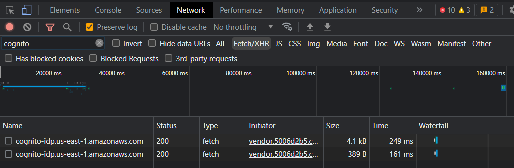

# Tims NHL Hockey Challenge Auto-Picker

The Tims NHL Hockey Challenge is an game on the Tim Hortons mobile app where users are given 3 lists of hockey players everyday, from which they select a player from each list. If a selected player scores that day, the user earns points that are redeemable for Tim Hortons goods!


This code automates the daily player submissions using a ranking system based on stats pulled from the following NHL APIs:
- https://gitlab.com/dword4/nhlapi
- https://github.com/peruukki/nhl-score-api

## Setup
### Obtain Tim Hortons app account details (Android devices)
The Tim Hortons app does not have a public API. Therefore, you will need to remote debug your android device to obtain your account's refresh token and client ID:
1. Setup remote debugging by following these [instructions](https://developer.chrome.com/docs/devtools/remote-debugging/).
2. Once your phone is connected, open the Tim Hortons app on your phone and inspect the respective tab on your computer, which should open a DevTools window. Install the Tim Hortons app if you haven't already.
3. Sign out of the app if you aren't already.
4. Watch the list of network activity names in the *Network* tab in the DevTools window as you sign into the app. 
   
   Filter for *"cognito"* and open the first `cognito-idp.us-east-1.amazonaws.com` activity and record the following values:
    - `user-agent` (found in the *Headers* tab)
    - `ClientId` (found in the *Payload* tab)
    - `RefreshToken` (found in the *Preview* or *Response* tab)
    
    Then use the search function (ctrl+f) to search for `thLegacyCognitoId` and record the value as `USER_ID`.
5. Create a `.env` file in the root directory of this repo and insert the values you found like so:
    ```
    USER_AGENT=___
    CLIENT_ID=___
    REFRESH_TOKEN=___
    USER_ID=___
    ```
6. Enter the Tims Hockey Challenge and complete the setup if you haven't already done so (may include a simple math question and contest display name prompt).
### Install dependencies
1. Install [Python3](https://www.python.org/downloads/).
2. Install the required dependencies: `pip install -r requirements.txt`.
3. Run `python autopicker/main.py` to start automatic player submissions.

## Scheduling (for Windows)
1. Open *Task Scheduler* and select *Create Task*.
2. Under the *Security options* in the *General* tab, select the option *Run whether user is logged on or not* and check the *Hidden* box.
3. In the *Triggers* tab, add a new trigger that you want. For example, you can select *On a schedule* and have the script run every day at a chosen time.
4. In the *Actions* tab, add a new action and insert the path of the `python.exe`. Then, insert the absolute path of this repo in the *Start in* input.
5. In the *Conditions* tab, check the box that says *Start only if the following network connection is available*.

## Logs
When `autopicker/main.py` is run, the `logs` directory is populated with various resources:
- `logs/autopicker.log`: contains runtime information/error messages for debugging
- `logs/history.json`: contains the pick submission results history of the connected Tim Hortons app account
- `logs/picks.json`: contains the latest picks that the code submitted
- `logs/rankings_set1.xlsx`, `logs/rankings_set2.xlsx`, `logs/rankings_set3.xlsx`: contains the ranking data of each of the 3 selection lists used to choose the top hockey players from the latest submission round
